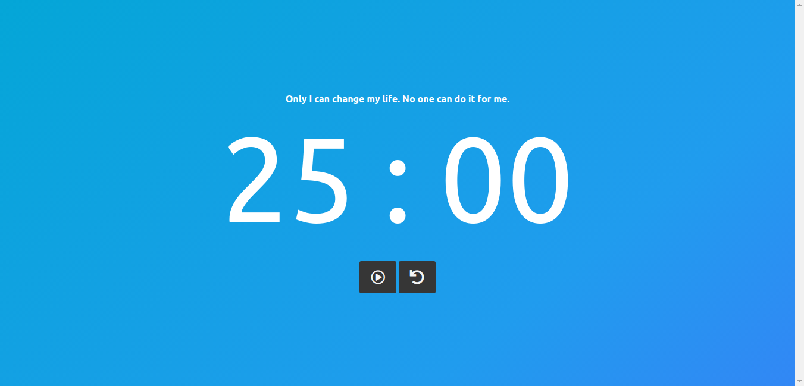
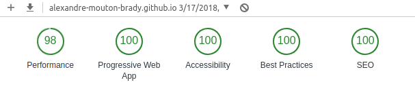

# Soch.io - Pomodoro Timer Challenge

[Link to the challenge](https://scotch.io/tutorials/code-challenge-6-build-a-pomodoro-timer)



## What I've used

* [hyperHTML by Andrea Giammarchi](https://github.com/WebReflection/hyperHTML) - My favorite view library, it's fun, intuitive, very efficient and respect standard.
* [Fuse-Box](https://github.com/fuse-box/fuse-box) - My favorite module bundler. Think of it as the simplicty and speed of Parcel with the customizability and features of Webpack. What I really like is the integrated Task Runner.
* [WorkBox by Google](https://developers.google.com/web/tools/workbox/) - PWA made easy by Google
* [FlatIcon](https://www.flaticon.com/) - For the icon
* [FaviconGenerator](https://www.favicon-generator.org/) - For the icons generation

## What I added

I set myself an extra challenge to make it a 100/100 PWA. Thanks to WorkBox and some proper meta tags it's mission accomplished! See the results from the Google Chrome Lighthouse Audit:



## Complentary information

If you want to install the app you'll have to:

* Clone the repo ```git clone https://github.com/alexandre-mouton-brady/pomodoro/```
* Run ```npm install``` or ```yarn``` to get all the dependencies
* Change the base url in the following files:
    * ```public/manifest.webmanifest``` (for the ```icons``` and ```start_url```)
    * ```src/index.html``` (for the manifest, icon and service worker registration)
    * ```/fuse.js``` (for the ```WebIndexPlugin``` path)
* Run ```npm run dev``` or ```yarn dev``` for development
* Run ```npm run build``` or ```yarn build``` for building
